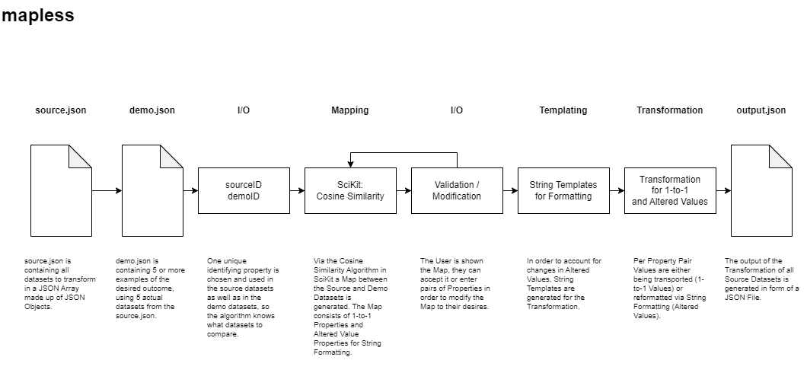

# mapless
[Mapless] Object Transformer in Python 3 using SciKit's Cosine Similarity Algorithm

## tech used

* Conda Environment providing Python 3.12
* SciKit-Learn: <code>pip install scikit-learn</code>

## module list

<code>pip list -l</code>

<textarea cols="33" rows="12">
Package       Version
------------- -------
joblib        1.4.2
numpy         2.2.3
pip           25.0
scikit-learn  1.6.1
scipy         1.15.2
setuptools    75.8.0
threadpoolctl 3.5.0
wheel         0.45.1
</textarea>

## concept

